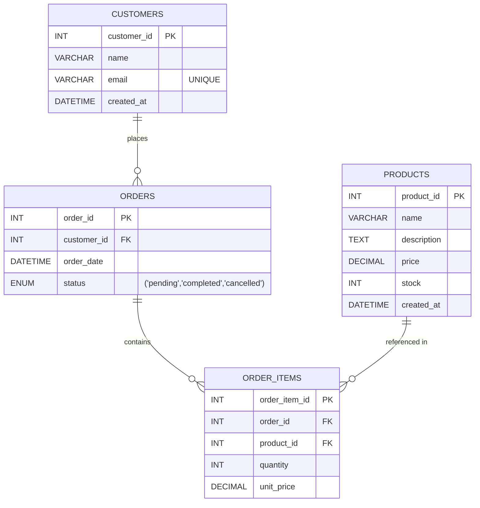

# 실습
Real MySQL을 학습하면서 진행할 실습 내용들을 정리

## 환경 구성
- docker container 생성 및 실행
```bash
docker compose up -d
```

- DB 접속 정보
    - Host: localhost
    - Port: 3306
    - User: user
    - Password: password
    - Database: studydb

## 기본 Table
기본 테스트를 위해 생성해 둔 깡통 Table이다.

### ERD


## 기타
- init.sql 수정 시 반영을 위해서는 volume 삭제해줘야 한다.